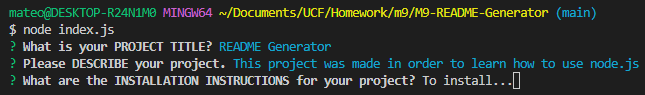
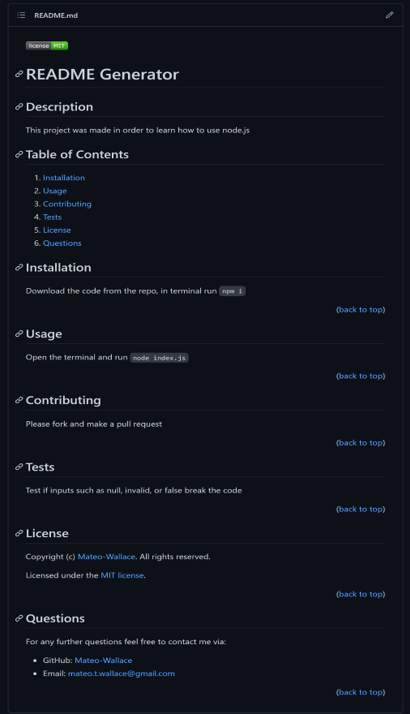
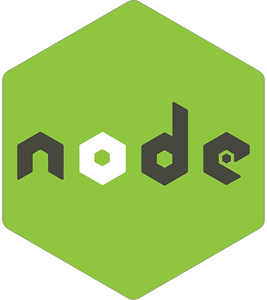

# M9-README-Generator

## Description:
This project was built using Node.js in order to write a quality README.md using the command line. It serves as an introduction to using JavaScript without the browser.

While building this project I learned to:

- Initialize node using `npm init -y`
- Load a third party module using `npm i <third-party-title-here>`
- Use [fs](https://nodejs.org/dist/latest-v16.x/docs/api/fs.html) core module to write a new file
- Use [inquirer](https://www.npmjs.com/package/inquirer) third party module to `.prompt` questions in the command line
- Reference a variable within a string - *Ex. `'This is a string ${data.thisIsAnInput}'`*

## Table of Contents
- [Installation](#installation)
- [Usage](#usage)
- [Contributing](#contributing)
- [Tests](#tests)
- [License](#license)
- [Questions](#questions)
- [Acknowledgments](#acknowledgments)
- [Technology](#technology)

## Installation

1. Clone the repo down to your local machine.
2. If you don't have Node.js, navigate to [nodejs.org](https://nodejs.org/en/) & download v16.18.0 or LTS.
3. Open the directory in your terminal and run `npm i` in order to download [inquirer](https://www.npmjs.com/package/inquirer).

(<a href="#readme-top">back to top</a>)

## Usage

Open your terminal, and in the command line run 

	node index.js

Follow the prompts and answer as accurately as possible.

Once all inputs have been logged, the README.md will be updated with user inputs. From here copy the file and do with it as you wish.

(<a href="#readme-top">back to top</a>)

## Contributing

If you have a suggestion that would make this better, please fork the repo and create a pull request. You can also simply open an issue with the tag "enhancement". Don't forget to give the project a star! Thanks again!

1. Fork the Project
2. Create your Feature Branch (git checkout -b feature/AmazingFeature)
3. Commit your Changes (git commit -m 'Add some AmazingFeature')
4. Push to the Branch (git push origin feature/AmazingFeature)
5. Open a Pull Request

(<a href="#readme-top">back to top</a>)

## Tests

During the input prompts, try typing in `null`, `undefined`, or `false` to see if the project breaks.

(<a href="#readme-top">back to top</a>)

## License

Distributed under the MIT License. See [LICENSE](./LICENSE) for more information.

(<a href="#readme-top">back to top</a>)

## Questions

For any further questions feel free to contact me via:
- GitHub: [Mateo-Wallace](https://github.com/Mateo-Wallace)
- Email: [mateo.t.wallace@gmail.com](mailto:mateo.t.wallace@gmail.com)

(<a href="#readme-top">back to top</a>)

## Acknowledgments

Special thanks to these resources. You have proven invaluable to creating this project:
- [Othneil Drew - Best-README-Template](https://github.com/othneildrew/Best-README-Template/blob/master/README.md)
- [Beth Decarlo - professional-readme-generator](https://github.com/bethdecarlo/professional-readme-generator)

(<a href="#readme-top">back to top</a>)

## Technology

  
  
  

(<a href="#readme-top">back to top</a>)

